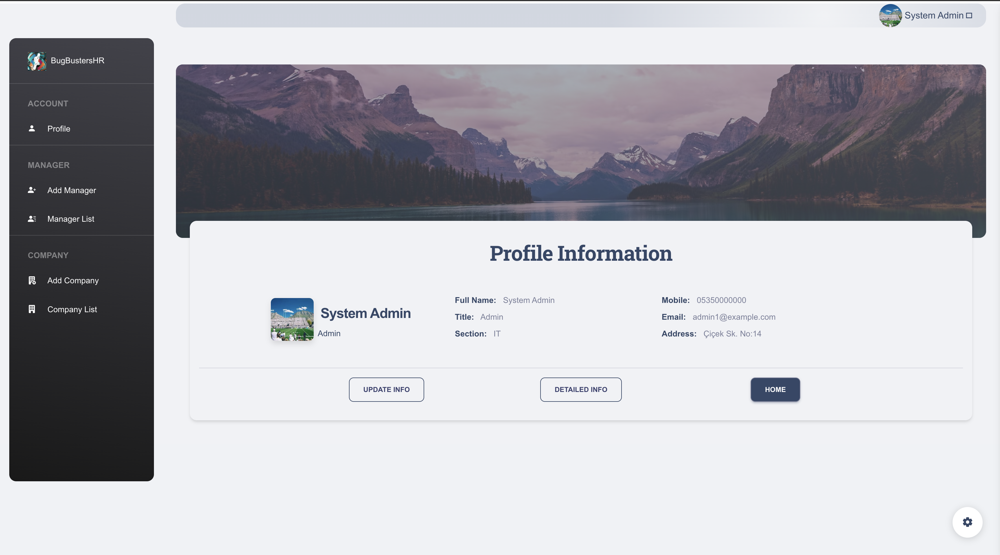
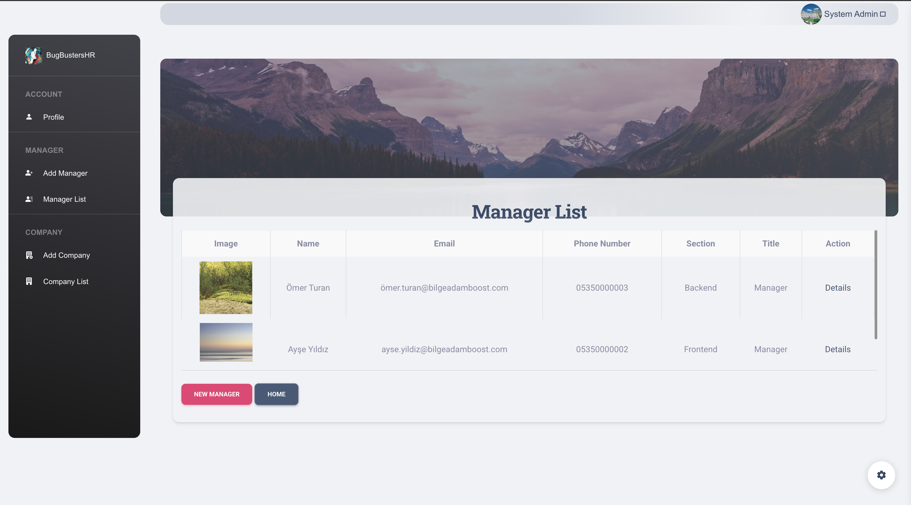
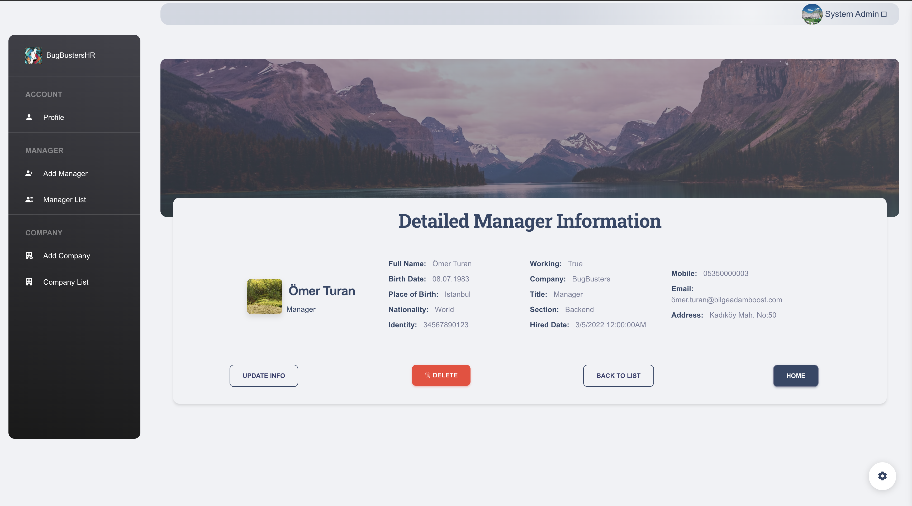

# HR Management System - Bugbusters

This is a Human Resources (HR) Management System built with **.NET 7 MVC**.  
The system includes three main roles: **Admin**, **Manager**, and **Employee**, and supports typical HR operations like leave requests, expense tracking, and user role management.

---

## Roles & Permissions

#### Admin
- Create and manage **Managers** and **Companies**
- Update manager and company information

#### Manager
- View and manage their **Employees**
- Approve or reject:
  - **Leave Requests**
  - **Expense Requests**
- Add employees to the company. Upon creation, employees receive an email to set their password and log in.

#### Employee
- Submit **Leave Requests**
- Submit **Expense Requests** for approval

---

The project was developed by a team of five developers following the Agile methodology. Azure DevOps was used for project and sprint management, while Git was utilized for version control and collaboration.

---

## Technologies Used

- [.NET 7 MVC](https://learn.microsoft.com/en-us/aspnet/core/mvc/overview?view=aspnetcore-7.0)
- [Entity Framework Core](https://learn.microsoft.com/en-us/ef/core/)
- [Azure SQL Server](https://azure.microsoft.com/en-us/products/azure-sql/)
- [Azure Blob Storage](https://azure.microsoft.com/en-us/products/storage/blobs/)
- **N-Tier Architecture**
- **Repository Pattern**


---

## Running on your Local

### ⚙️ Prerequisites

- [.NET 7 SDK](https://dotnet.microsoft.com/en-us/download/dotnet/7.0)
- [Docker](https://www.docker.com/)

### Start the Database with Docker

You can use the provided `docker-compose.yml` file to start the database locally:

```bash
docker-compose up -d
```

This will spin up an SQL Server container.

### Seed Mock Data

Using BugBustersHR.Seeder project to seed mock data:

```bash
cd ../BugBustersHR.Seeder
dotnet run
```

This will populate the database with initial data, and you can use the seeded credentials to log in.

#### You can run this project on MVC Layer:

```bash
cd ../BugBustersHR.UI
dotnet run
```


### 🔐 Default Login Credentials (From Mock Data)

Here are example credentials you can use to log in after seeding the database:


| Role     | Email                  | Password      |
|----------|------------------------|---------------|
| Admin    | admin1@example.com      | Passw0rd!     |
| Manager  | manager.ayse@bugbusters.com    | Passw0rd!   |
| Employee | employee.ali@bugbusters.com   | Passw0rd!  |


You can navigate three different roles and more than 12 designed pages and explore features.

### Screenshoots

#### Home Page


#### Login Page 


#### Admin Landing Page


#### Manager Lists Page


#### Manager Detail Page

